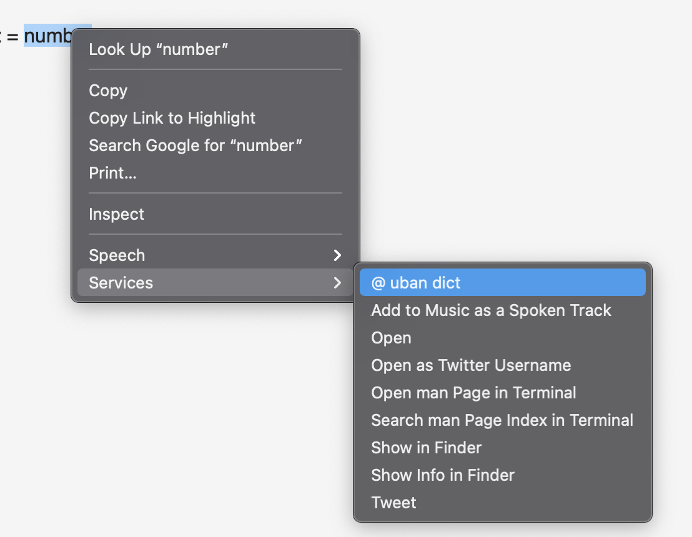
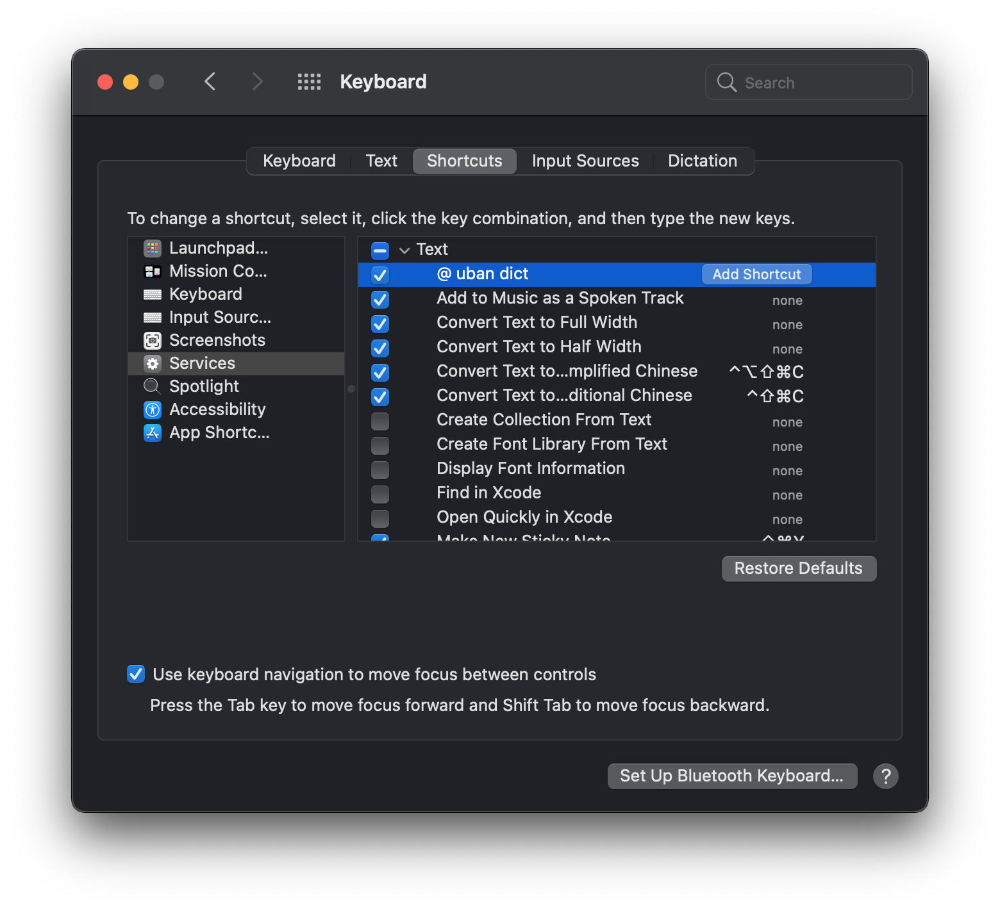

# Urban Dictionary macOS Automator Script / Workflow
A script written in Python and JavaScript for macOS Automator to search for words in Urban Dictionary using RapidAPI.

<h2>How-to-use</h2>
<b>For macOS users only.</b> 
1. Download as .zip file and double click on the workflow file (@ urban dict.workflow) to install the script.  
2. Follow the following demo screenshot to use: select any word within any Apps, right click, go to 'Services' -> '@ urban dict'.  
  

3. (Optional) Follow the following screenshot to add global keyboard shortcut in system preference. Once shortcut is set, you can select any word within any app and press your personalized shortcut to search the word. 
 

